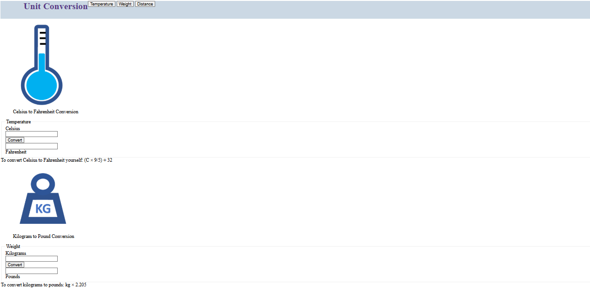

# Unit Conversion 🌐

A simple **Unit Conversion Web Application** built using **HTML** and styled with **CSS**.  
This project allows you to convert **Temperature, Weight, and Distance** with interactive input fields and useful conversion formulas.

---

## 🚀 Features
- 🌡️ **Temperature Conversion** (Celsius ↔ Fahrenheit)  
- ⚖️ **Weight Conversion** (Kilograms ↔ Pounds)  
- 📏 **Distance Conversion** (Kilometers ↔ Miles)  
- 📚 Includes conversion formulas as reference  
- 🎨 Styled with CSS for a clean and simple UI  

---

## 🛠️ Technologies Used
- **HTML5**  
- **CSS3**  

---

## 📂 How to Run
1. Clone the repository:
   ```bash
   git clone https://github.com/your-username/unit-conversion-html.git
Open the index.html file in any browser.

Start converting units 🎉

---

## 📸 Demo Screenshot


---


## 👨‍💻 Author
**Abdul Rehman**  

[](https://github.com/AbdulRehman393) 
[](https://www.linkedin.com/in/khawaja-abdul-rehman-24088b266/) 
[](mailto:khawajaabdulrehman393@gmail.com)  

---

<p align="center">
  ⭐ If you found this useful, don't forget to star the repo! ⭐
</p>
